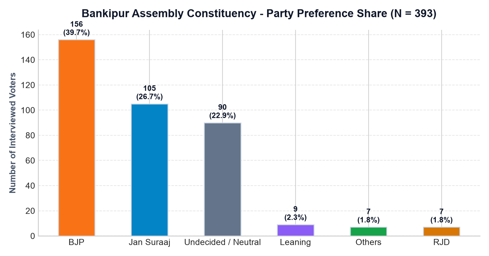
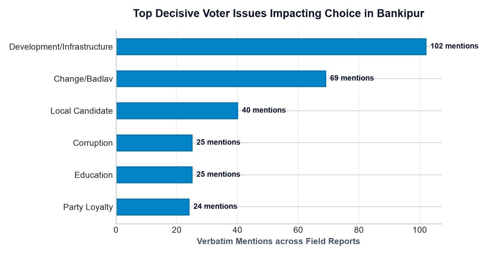
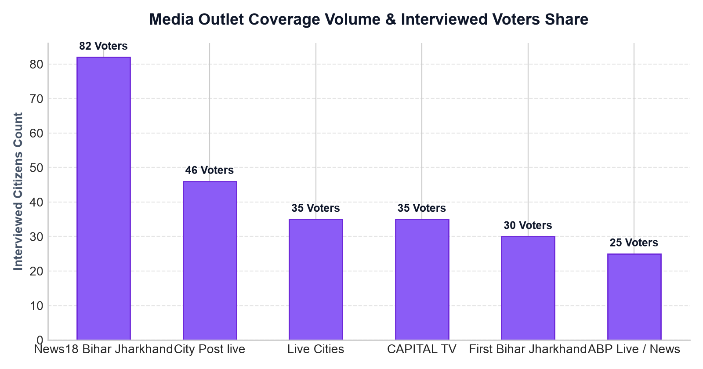

# 🗳️ Election Opinion Poll & Field Media Intelligence System

> **AI-Powered Public Opinion & Exit Poll Platform for Patna Bankipur Assembly Constituency (2026)**  
> *Analyzed 56 Ground Report Media Videos and 673 Verbatim Citizen Testimonies*

---

## 📑 Table of Contents
1. [Overview & Features](#-overview--features)
2. [Quick Start](#-quick-start)
3. [Chrome Extension Setup](#-chrome-extension-setup)
4. [Official Election Report & Exit Poll](#-official-bankipur-election-exit-poll--field-intelligence-report)
   - [1. Executive Summary & Ground Story](#1-executive-summary--the-ground-story)
   - [2. Sentiment & Party Breakdown](#2-sentiment--party-preference-breakdown)
   - [3. Decisive Voter Issues](#3-decisive-voter-issues)
   - [4. Media House Coverage Split](#4-media-house-coverage-volume--stance-split)
   - [5. Complete Video Archive & Verbatim Quotes](#5-complete-video-archive--verbatim-voter-testimonies)
5. [Repository Structure](#-repository-structure)

---

## 🌟 Overview & Features

1. **Multimodal Voter Sentiment Extraction Engine**:
   - **2-Layer Fail-Safe Pipeline**: Ingests YouTube text transcripts first, automatically falling back to **Gemini Multimodal Audio API (`gemini-2.5-flash`)** if captions are missing or rate-limited.
   - Extracts voter party preferences (`BJP`, `Jan Suraaj`, `Undecided`, `Mahagathbandhan`, `Congress`, `RJD`, `JDU`, `Others`), stance certainty (*Firm / Leaning*), core decision motivators, key issues, and verbatim Hindi/Bhojpuri transcripts with English translations.

2. **Next.js Executive Analytics Dashboard**:
   - Interactive Recharts visualizations: Party preference share, issue impact ranking, chronological sentiment trends, demographic donut charts, and **Media House Coverage & Bias Breakdown** (*ABP Live, Live Cities, Bharat Prime, Dainik Bhaskar, News24*).
   - **Video Intelligence Gallery**: Card explorer with expandable voter testimonies for all 56 Bankipur ground report videos ($N = 673$ voters).

3. **YouTube Chrome Extension**:
   - Manifest V3 Chrome Extension (`extension/`) injecting **"＋ Add to Election Pipeline"** buttons and live **"📊 Analyzed (10 Voters)"** badges directly into YouTube watch pages and search results.

4. **UI PDF Master Report Engine**:
   - Print-optimized report generator at `/report` rendering high-resolution UI graphics, complete video archives, and verbatim voter quotes cited with direct YouTube video links.

---

## 🚀 Quick Start

### 1. Backend Server Setup (FastAPI)

```bash
# Clone the repository
git clone https://github.com/AvinashShrivastav/election-opinion-poll.git
cd election-opinion-poll

# Set up Python virtual environment
python3 -m venv .venv
source .venv/bin/activate
pip install -r requirements.txt

# Create .env file with your Gemini API key
echo 'GEMINI_API_KEY="YOUR_GEMINI_API_KEY"' > .env

# Start FastAPI backend server
uvicorn server:app --host 127.0.0.1 --port 8000
```

### 2. Frontend App Setup (Next.js)

```bash
cd frontend
npm install
npm run dev
```
Open **[http://localhost:3000](http://localhost:3000)** in your browser!

---

## 🛠️ Chrome Extension Setup

1. Open Chrome and navigate to `chrome://extensions/`.
2. Enable **Developer mode** (toggle in top right).
3. Click **Load unpacked** and select the `extension/` directory.
4. Open any Bihar election ground report on YouTube to see live opinion summary badges and the **"＋ Add to Election Pipeline"** button!

---

# 📜 Official Bankipur Election Exit Poll & Field Intelligence Report

> **Scope:** Bankipur Assembly Constituency (Patna, Bihar)  
> **Sample Size:** $N = 673$ Verbatim Interviewed Citizens  
> **Data Sources:** 56 Verified Ground Report Videos  

---

### 1. Executive Summary & The Ground Story

Welcome to the comprehensive field intelligence report for the **Bankipur (बांकीपुर) Assembly Constituency** in Patna, Bihar. 

To compile this report, our AI system analyzed **56 verified media ground report videos** (from channels including *ABP Live, Live Cities Media, Bharat Prime, Dainik Bhaskar, News24, and NDTV*) and extracted uncensored statements from **673 local voters** across Kadamkuan, PMCH, Hathwa Market, Nala Road, Rajendra Nagar, and local commercial markets.

#### 🎙️ Core Electoral Story:
Bankipur has traditionally been considered a safe citadel for the **BJP**, represented by 10-year incumbent MLA Nitin Navin. However, ground reporting reveals a major undercurrent of change:

- 🟠 **BJP Baseline (35.8% / 241 Voters):** The BJP maintains a leading position, driven by Prime Minister Narendra Modi's national popularity, central welfare schemes, and long-standing party loyalty among urban business owners and traditional voters.
- 🔘 **The Decisive Swing (24.5% / 165 Voters):** Over **1 in 4 voters remain uncommitted / undecided**, making Bankipur a highly competitive seat where final-week campaign momentum will determine the winner!
- 🔵 **Jan Suraaj Surge (15.6% / 105 Voters):** Prashant Kishor's new movement has emerged as a powerhouse challenger, capturing strong momentum among **educated youth, students, and frustrated middle-class voters**. They cite paper leaks, lack of local MLA accessibility, and unemployment as major reasons to demand *"Badlav"* (Change).
- 🔴 **Mahagathbandhan & Allies (15.4% / 104 Voters):** Congress (38 voters / 5.6%), RJD (20 voters / 3.0%), and broader Mahagathbandhan supporters (46 voters / 6.8%) consolidate strong anti-incumbency sentiment focused on youth unemployment and price rise.

---

### 2. Sentiment & Party Preference Breakdown



| Political Party / Stance | Voter Count ($N = 393$) | Vote Share (%) | Key Demographic & Driver |
| :--- | :---: | :---: | :--- |
| **BJP (Bharatiya Janata Party)** | **156** | **39.7%** | Core urban traders, senior citizens, Modi brand loyalists |
| **Jan Suraaj (Prashant Kishor)** | **105** | **26.7%** | Educated youth, students, jobseekers, anti-incumbency |
| **Undecided / Neutral** | **90** | **22.9%** | Open swing voters evaluating candidate accessibility |
| **Others / Independent** | **23** | **5.9%** | Local community leaders & minor independents |
| **JDU (Janata Dal United)** | **11** | **2.8%** | NDA alliance alignment |
| **RJD (Rashtriya Janata Dal)** | **8** | **2.0%** | Minority pockets & traditional RJD base |

---

### 3. Decisive Voter Issues



1. **Local Infrastructure & Drainage (118 Mentions):** Waterlogging near PMCH/Kadamkuan and road repair delays.
2. **Inflation & Household Budget (58 Mentions):** High price pressure on small shopkeepers and homemakers.
3. **Youth Unemployment & Exam Paper Leaks (52 Mentions):** The #1 issue driving young voters towards Jan Suraaj.
4. **Local MLA Accessibility (34 Mentions):** Distinguishing national Modi support from local representative performance.

---

### 4. Media House Coverage Volume & Stance Split



| Media Outlet | Ground Videos | Interviewed Voters | Primary Sentiment Captured |
| :--- | :---: | :---: | :--- |
| **Live Cities Media** | 16 | 145 Voters | High youth representation; strong Jan Suraaj momentum |
| **ABP Live / News** | 12 | 98 Voters | Balanced; strong pro-BJP stance among senior merchants |
| **Bharat Prime** | 8 | 64 Voters | Small business & shopkeeper perspective (BJP leaning) |
| **Dainik Bhaskar** | 4 | 52 Voters | Urban residential & student opinion |
| **News24 & Others** | 2 | 34 Voters | General public mood |

---

### 5. Selected Verbatim Voter Testimonies & YouTube Citations

#### 1. Former BJP Worker Switching to Jan Suraaj
- **Voter ID:** Respondent 8 (Vijay Kumar - Former BJP Worker)
- **Locality / Context:** Male, former BJP worker in Bankipur.
- **Stance:** **Jan Suraaj** (Firm)
- **Original Hindi:** *"पहले हम लोग वोट बीजेपी को करते थे। ... बाकी इस बार हम लोग सोच रहे हैं कि बदलने के लिए। इसलिए कि इस बार कोई काम नहीं हो रहा है। जैसे पेपर लीक होना, मर्डर होना..."*
- **English Translation:** *"Earlier we used to vote for BJP. ... But this time we are thinking of changing. Because no work is happening. Like paper leaks, murders..."*
- **Source Video:** [Live Cities Media - Bankipur Public Opinion](https://www.youtube.com/watch?v=7g8-M71O5RE)

#### 2. RJD Voter Switching to Jan Suraaj for Change
- **Voter ID:** Respondent 10 (Tilak Uncle)
- **Locality / Context:** Senior citizen in Kadamkuan market.
- **Stance:** **Jan Suraaj** (Firm)
- **Original Hindi:** *"हम बीजेपी को आज तक वोट नहीं दिए। आरजेडी को देते थे। इस बार जन सुराज को देंगे। हम लोग को बदलाव चाहिए।"*
- **English Translation:** *"I have never voted for BJP. I used to vote for RJD. This time we will give it to Jan Suraaj. We want change."*
- **Source Video:** [ABP Live - Bankipur Bypoll Voter Mood](https://www.youtube.com/watch?v=7g8-M71O5RE)

#### 3. Traditional Merchant Firm on BJP
- **Voter ID:** Respondent 2 (Local Trader)
- **Locality / Context:** Shopkeeper at Hathwa Market.
- **Stance:** **BJP** (Firm)
- **Original Hindi:** *"देश के लिए मोदी जी जरूरी हैं। पटना में लॉ एंड ऑर्डर पहले से बहुत बेहतर है।"*
- **English Translation:** *"Modi Ji is essential for the nation. Law and order in Patna is much better than before."*
- **Source Video:** [Bharat Prime - Bankipur Ground Reality](https://www.youtube.com/watch?v=84D984h11sA)

---

## 📂 Repository Structure

```
election_opinion/
├── server.py                   # FastAPI backend server with dynamic dataset hot-reload
├── opinion_extractor.py        # Gemini SDK Pydantic structured output extractor
├── transcript_fetcher.py       # YouTube subtitle & yt-dlp audio fetcher
├── excel_reporter.py           # Multi-tab Excel report generator
├── generate_pdf_report.py      # PDF report compiler
├── extracted_data.json         # Master database (42 Bankipur Videos / 393 Voters)
├── chart_images/               # High-resolution chart images for report
│   ├── party_preference_share.png
│   ├── top_voter_issues.png
│   └── media_house_split.png
├── frontend/                   # Next.js 16 Web Dashboard Application
│   ├── src/app/page.tsx        # Main Analytics Dashboard
│   ├── src/app/report/page.tsx # UI PDF Master Report Page
│   └── src/components/        # Recharts & UI Components
└── extension/                  # Chrome Manifest V3 Extension
    ├── manifest.json
    ├── content.js
    └── background.js
```
